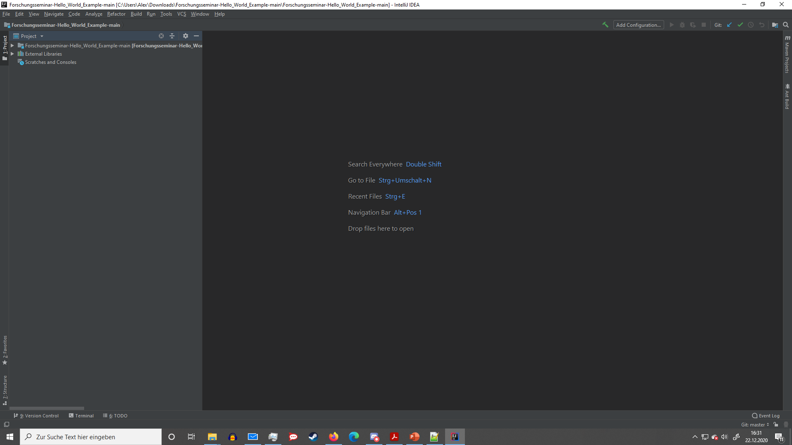

# Forschungsseminar-Hello_World_Example

######  Description ###### 
This is a small application which, when executed, prints the sentence "Hello World" in the console.

######  Required Applications ###### 
1. IntellJ

######  Installation ###### 
1. Download (and unzip) or clone the Repository in any Direction of your choice.
2. Choose the Option "Add Configuration" in the top-right corner next to the "Run"-function.

3. In the Window, press on the "+" to add a new ´configuration, choose the option "JAR Application".

4. Select the path to the Applcation (c.f Screenshots) and choose the JAR File.

5.Done, you can now run the Application.

